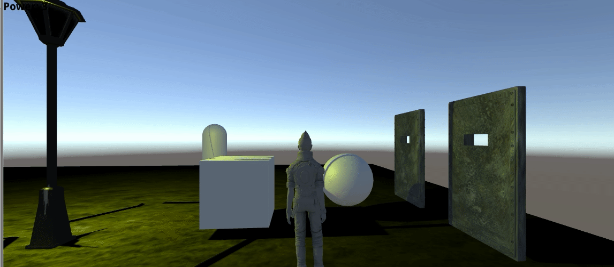

### Practica 3:

* La escena contiene el principio de lo que será nuestro proyecto final. La idea es crear un laberinto de miedo que contenga consumibles, objetos ocultos, habitaciones con puzzles, etc.
    * Se ha creado un escenario muy básico porque estamos investigando poder automatizar la generación del laberinto mediante algoritmos y nos requiere más tiempo del disponible. Si se realizara se añadirá más adelante.
    
* Si el jugador choca con una esfera se incrementa su poder. (Esquina superior izquierda)

* Si el jugador se acerca a una puerta, todas las puertas del mapa se abrirán.

* Si el jugador pulsa la tecla 'L' se enciende y apaga una luz.

